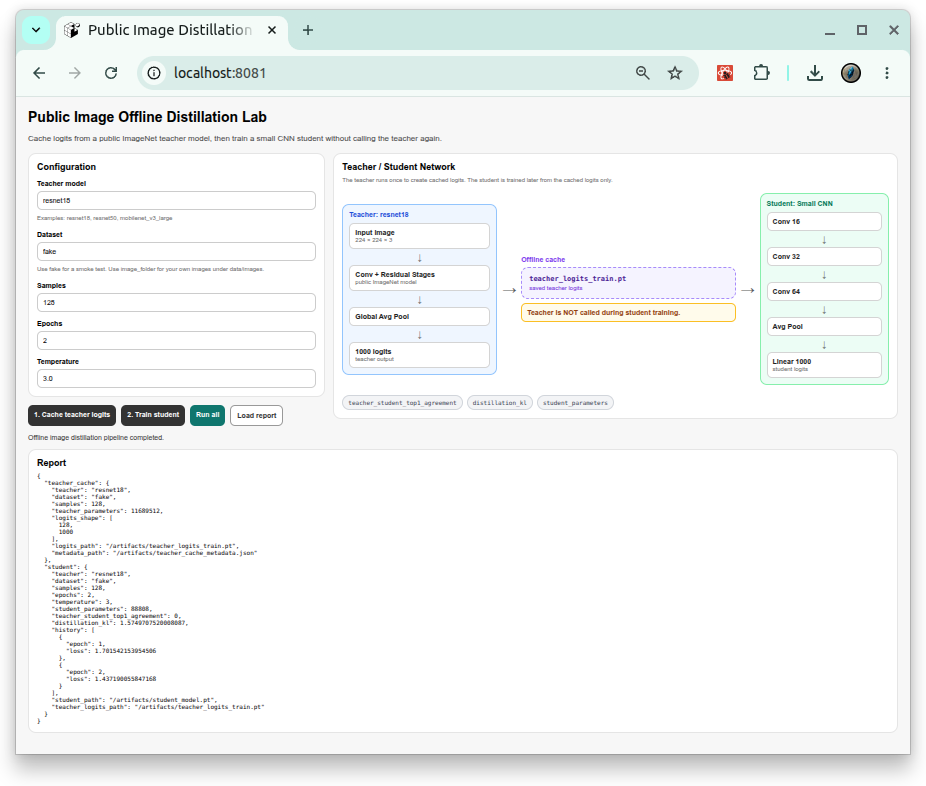

# [Image Offline Distillation](https://github.com/europanite/image_ai_offline_distillation "Image Offline Distillation")

[](https://opensource.org/licenses/Apache-2.0)

[](https://www.python.org/)


[](https://github.com/europanite/image_ai_offline_distillation/actions/workflows/codeql.yml)
[](https://github.com/europanite/image_ai_offline_distillation/actions/workflows/lint.yml)
[](https://github.com/europanite/image_ai_offline_distillation/actions/workflows/ci.yml)
[](https://github.com/europanite/image_ai_offline_distillation/actions/workflows/pytest.yml)



A small container for **offline knowledge distillation**.

The project keeps a simple full-stack shape:

- **Backend**: FastAPI + PyTorch + torchvision
- **Frontend**: Expo / React Native Web
- **Container**: Docker Compose

## What this learns

This repository does not train a large diffusion model. It teaches the offline distillation pattern with a public image classifier:

```text
public ImageNet teacher model
  -> run once on images
  -> save teacher logits
  -> train a small CNN student from cached logits
  -> compare teacher/student agreement
```

The default teacher is `torchvision.models.resnet18` with public ImageNet weights. You can also use `resnet50` or `mobilenet_v3_large`.

The student is a tiny CNN that outputs the same 1000 ImageNet logits. It is trained to imitate the teacher's softened probability distribution.

## Why this is offline distillation

The key artifact is:

```text
artifacts/teacher_logits_train.pt
```

After this file is created, the student can be trained without calling the teacher model again.

## Dataset modes

| Dataset | Purpose |
| --- | --- |
| `cifar10` | Downloads CIFAR-10 and resizes it to ImageNet input size. |
| `image_folder` | Uses your own unlabeled images under `data/images`. |

For a real experiment, put images here:

```text
data/images/
```

Nested folders are allowed. Labels are not required.

## Start

```bash
docker compose down -v
docker compose down -v
docker compose up --build
```


> The frontend service uses Expo Web with Docker `network_mode: host` so that `expo start --web --localhost --port 8081` is reachable from the host browser. This is intended for Linux Docker environments.

Open:

```text
Frontend: http://localhost:8081
Backend:  http://localhost:8000/docs
```

## Run from API

```bash
curl -X POST http://localhost:8000/api/v1/distillation/run-all \
  -H 'Content-Type: application/json' \
  -d '{
    "teacher": "resnet18",
    "dataset": "fake",
    "samples": 128,
    "batch_size": 16,
    "epochs": 2,
    "learning_rate": 0.001,
    "temperature": 3.0,
    "device": "cpu"
  }'
```

## Run from CLI

```bash
docker compose run --rm backend python /app/cli.py run-all \
  --teacher resnet18 \
  --dataset fake \
  --samples 128 \
  --batch-size 16 \
  --epochs 2 \
  --temperature 3.0 \
  --device cpu
```

For your own image folder:

```bash
docker compose run --rm backend python /app/cli.py run-all \
  --teacher resnet18 \
  --dataset image_folder \
  --samples 256 \
  --epochs 3 \
  --device cpu
```

## Outputs

```text
artifacts/
├── teacher_logits_train.pt
├── teacher_cache_metadata.json
├── student_model.pt
└── report.json
```

`report.json` includes:

- `teacher_student_top1_agreement`
- `distillation_kl`
- `student_parameters`
- training loss history

## Tests

```bash
docker compose -f docker-compose.test.yml run --rm backend_test
docker compose -f docker-compose.yml -f docker-compose.test.yml run --rm frontend_test
```
